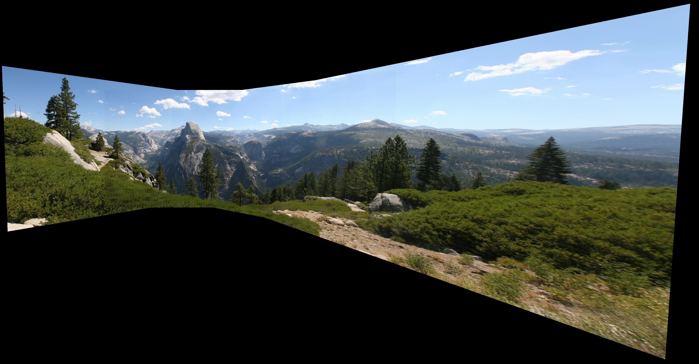
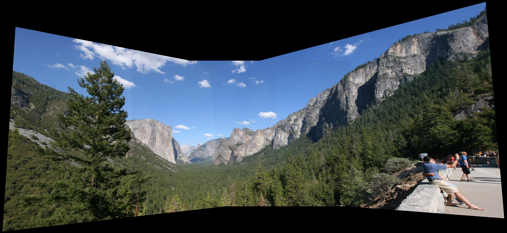

# Panorama Stitching 101


## Introduction

Computer Vision homework #2.

See [Implementation Details](#Implementation-Details) for usage examples.

> If the camera center is fixed, or if the scene is planar, different images of the same scene are related by a homography. In this project, you will implement an algorithm to calculate the homography between two images. Several images of each scene will be provided. Your program should generate image mosaics according to these estimated homographies.

We implement the four basic components of a panorama stitching pipeline:

1. Feature detection, description using SIFT / Concatenated pixel
2. Exhaustive feature matching between image pairs with ambiguity check
3. Homography estimation using DLT and M-estimator with RANSAC
4. The actual panorama stitching using linear alpha blending

Then we go on to propose a new graph shortest path based sequential homography method to perform panorama stitching on a set of unordered images with arbitrary perspective transform (e.g. when some of the image pairs have literally zero content overlap).

We are not sure whether such algorithm exist in literature due to limited knowledge of the author, however we do implement it and it seem to work much better than selecting on pivot image and match every other ones on it.

We evaluate the performance of our algorithm on 4 sets of images. Note that the number of images in the provided dataset is quite small (3-5 images). We also provide a comparison between the SIFT descriptor and concatenated pixel descriptor, analysing their respective influence on the number of RANSAC iterations.

## Method


### Feature Detection and Descriptor

For feature detector, we adopted [kornia's implementation of SIFT detector](https://github.com/kornia/kornia-examples/blob/master/image-matching-example.ipynb) by constructing a `ScaleSpaceDetector`. We chunk the images before feeding them to the feature detector to avoid running out of memory by a heuristic batch size. Note that to retain parallelism, we extract a fixed number of features for each image (typically 5000). After feature detection, we perform feature extraction with the user selected feature descriptor.

-   For SIFT, we use the `SIFTDescriptor` class provided by [kornia](https://github.com/kornia/kornia).
-   For pixel concatenation descriptor, we simply aggregate all pixel values of a patch by concatenation to form its descriptor.

It's worth noting that this concatenation is merely for the **descriptor**, both SIFT and pixel concantenation use the same SIFT **detector** thus we don't expect to see any difference in the detected features.

### Feature Matching

We implement an naive exhaustive feature matching technique by utilizing the `cdist` function to densely compute feature distances. Note that we have all images instead of only one pair of them in mind when performing this panorama stitching, thus **exhaustive** is refering to not the way we compute distance between every pair of features, but the way we compute distance between every pair of images.

We also implement a simple ambiguity check to remove false matches. For an image pair and for one of the feature in the first image, we find the best and second best match in the second image. If the distance ratio between the best and second best match is larger than a threshold, we consider the match to be ambiguous and remove it. The threshold of discarding a matching is controlled dynamically by a user parameter `match_ratio`. Specifically, we find the cut-off value of the distance ratio to retain `match_ratio * 100` percent of all matches and use this cut-off value to determine which match to discard. `match_ratio` is set to `0.9` in all experiments if not specified otherwise (meaning, 90% of all matches will be retained).

### Homography Estimation

The transformation between two images can be described with a homography, defined by a $3 \times 3$ matrix with 8 degrees of freedom (after normalizing the last element to 1.0). To obtain this homography, we need at least four pairs of observation. Each of them provides us with 2 linearly independent equations. Thus we 4 pairs of observations and 8 equations in total we can solve the least square homography estimation problem with the DLT (Discrete Linear Transform) algorithm by SVD decomposition on the constructed linear system of equations.

We perform RANSAC on top of the proposed DLT algorithm to obtain a good estimation and discard outliers reliably. During experiments we found that RANSAC essential to the success of the homography estimation. Since one or two outliers would lead to a completely wrong result. We first perform a few random experiments `min_iter` to determine the number of iterations required to achieve a certain `confidence` level. The number of expected iterations `exp_min_iter` is dynamically changed with the estimated ratio of inlier `inlier_ratio`. `exp_min_iter` is determined with the following equation:

```python
def find_min_iter(inlier_ratio, confidence, min_sample):
    return int(np.ceil(np.log(1 - confidence) / np.log(1 - inlier_ratio**min_sample)))
```

Where `min_sample` is 4 as determined in the first paragraph of this section. This equation computes the number of iteration required to have `confidence` probability of have a random sampling with all inliers, which will lead to the success of the RANSAC algorithm.

> "All good matches are alike; every bad match is bad in its own way." - Leo Tolstoy

After obtaining the largest set of inliers, we perform M-estimation on those pairs. M-estimation convert the linear least square homography estimation problem to a non-linear one with a robust error function ignoring outliers. To optimize this non-linear problem, we define the robust error function and symmetric error function with differentiable PyTorch operators and perform 1000 iterastion with the Adam optimizer of learning rate `1e-2`.

To obtain a more robust estimation, we repeat the M-estimator with the updated inlier set of the first M-estimation.

### Graph-based Sequential Homography

This section is not required by the homework specification. But we found that to generate a good panorama image, it's important to consider all the images in a set instead of just two of them. In a large image set, it's very common find two images without any overlap. However it is typically possible to find a path of images that connect them with partial overlap along the way. In this case, it's natural to consider the concatenated path of homography instead of just a single one of them.

To find this homography, we define a connectivity image graph on the collection of images. We represent this graph via a modified version of the adjacency matrix, where the $j$th element of the $i$th row on the matrix represent the reciprocal of the number of matches from image $i$ to image $j$. Thus, to find the best sequence of homography between any pair of images, we apply the Floyd-Warshall algorithm on the modified adjacency matrix to find the all pair shortest path and shortest distance of this graph. We implemented a parallel GPU version of the algorithm where only an outer loop of $N$, instead of $N^3$ is required, compared to the naive Floyd-Warshall implementation:

```python
def parallel_floyd_warshall(distance: torch.Tensor):
    # The Floyd-Warshall algorithm is a popular algorithm for finding the shortest path for each vertex pair in a weighted directed graph.
    # https://www.baeldung.com/cs/floyd-warshall-shortest-path
    # https://cse.buffalo.edu/faculty/miller/Courses/CSE633/Asmita-Gautam-Spring-2019.pdf
    # https://saadmahmud14.medium.com/parallel-programming-with-cuda-tutorial-part-4-the-floyd-warshall-algorithm-5e1281c46bf6
    assert distance.shape[-1] == distance.shape[-2], 'Graph matrix should be square'
    V = distance.shape[-1]

    # Connection matrix, later used for extracting shortest path
    connect = distance.new_full(distance.shape, fill_value=-1, dtype=torch.long)
    for k in range(V):
        connect_with_k = distance[:, k:k + 1].expand(-1, V) + distance[k:k + 1, :].expand(V, -1)
        closer_with_k = connect_with_k < distance
        distance = torch.where(closer_with_k, connect_with_k, distance)
        connect = torch.where(closer_with_k, k, connect)  # if 1, go to k, else stay put
    return distance, connect  # geodesic distance (closest distance of every pair of element)


def extract_path_from_connect(i, j, connect) -> List[int]:
    # https://stackoverflow.com/questions/64163232/how-to-record-the-path-in-this-critical-path-algo-python-floyd-warshall
    k = connect[i][j]
    if k == -1:
        return [i, j]
    else:
        path = extract_path_from_connect(i, k, connect)
        path.pop()  # remove k to avoid duplicates
        path.extend(extract_path_from_connect(k, j, connect))
        return path
```

Now, we the shortest path between image pairs available, we find every pair of homography along the way and concatenate them with matrix multiplication. Note that we still require a pivot image to perform the final stitching. It might be helpful to construct a best virtual image plane for all the homography in the future. The shortest path and its corresponding homography transformation from every image to the pivot is computed in this stage.

### Panorama Stitching

Afterwards, we warp all pixels from the source image to the pivot by the homogrphy:

1. First we define the four corners of the source image in its original frame.
2. Then we transform the corners to the pivot to determine the range of pixels (in a rectangle `meshgrid`) to sample in the pivot's space.
3. Using the inverse of the homography, we warp the samples back to the source image, and perform `grid_sample` to get the pixel value.
4. Note that we also record a binary mask to determine whether a pixel is valid since not all samples from the rectangle in step 2 is valid.
5. All those pixel values are assigned to the preallocated `meshgrid` defined in step 2 and returned along with the binary mask.

We perform the final image stitching with a simple parallel linear blending algorithm:

1. First we determine the final canvas size to fit all samples in step 2 of the previous procedure.
2. Then we accumulate the pixel values and mask values by simply summing them up.
3. The division result between the pixel values and mask values produces the final pixel values of the blended image.

## Implementation Details

We implemented our pipeline with PyTorch (even the graph shortest path part) for GPU acceleration and further scalability considerations.

With the default arguments, we perform parallel image loading onto the user defined device (RAM or VRAM) and perform feature detection and description on the GPU. We then perform exhaustive feature matching on the CPU and GPU, after which homography estimation are done on the GPU. We then perform panorama stitching on the GPU.

Every experiments except `data1` should take no longer than 30 seconds to finish on an RTX 2080 Ti GPU with the default arguments.
`data1` should take no longer than 60 seconds with the default arguments.

```shell
python main.py --data_root <DATASET_ROOT/IMAGE_SET>

# examples:
python main.py --data_root data/data1 # run on data1 with default arguments, this works with a 2080 Ti
python main.py --data_root data/data1 --verbose --visualize # run on data1 with default arguments, print every log, save detection and matching results
python main.py --data_root data/data1 --device cpu --n_feat 10000 --match_ratio 0.7 # run on data1, perform every computation on cpu instead of cuda, extract 10000 instead of 5000 features, and retain 70% instead 90% of all matches
```

We also provide a simple script to run all sets of images provided in a dataset with both the SIFT and pixel concatenation descriptor.

```shell
python run_exps.py --data_root <DATASET_ROOT>
```

## Experiments

Here we provide the final stitching images for all datasets provided:

#### `data1`


#### `data2`



#### `data3`



#### `data4`


#### Comparison Between `SIFT` And `Pixel` Descriptor

On `data1`, image `0` to image `1`

**Pixel Concatenation Descriptor:**


**SIFT Descriptor**


It's easy to notice that the **SIFT** has a stronger ability to match the inliers in the middle of the image regions.

A table summarizing all RANSAC experiments (`match_ratio: 0.9, confidence: 1-1e-5, threshold: 1e-5`):

|               | RANSAC iter(`SIFT`) | Inlier ratio (`SIFT`) | RANSAC iter (`pixel`) | Inlier ratio (`pixel`) |
| ------------- | ------------------- | --------------------- | --------------------- | ---------------------- |
| `data1-00-02` | 109                 | 0.562674              | 80                    | 0.507998               |
| `data1-01-02` | 53                  | 0.667253              | 59                    | 0.651235               |
| `data1-03-02` | 25                  | 0.783849              | 30                    | 0.751966               |
| `data1-04-02` | 31                  | 0.746356              | 40                    | 0.708920               |
| `data1-05-02` | 27                  | 0.768663              | 24                    | 0.791209               |
| `data2-00-02` | 80                  | 0.506760              | 60                    | 0.577648               |
| `data2-01-02` | 48                  | 0.680380              | 39                    | 0.714286               |
| `data2-03-02` | 39                  | 0.711083              | 20                    | 0.819625               |
| `data3-00-01` | 87                  | 0.593607              | 135                   | 0.534940               |
| `data3-02-01` | 42                  | 0.703209              | 115                   | 0.555874               |
| `data4-00-02` | 61                  | 0.566602              | 25                    | 0.783529               |
| `data4-01-02` | 32                  | 0.743830              | 46                    | 0.687500               |
| `data4-03-02` | 41                  | 0.705437              | 70                    | 0.544305               |
| Average       | 51.92               | 0.672285              | 57.15                 | 0.663772               |

It's clear that using SIFT descriptor would often lead to smaller number of iterations due to the larger number of inliers.
